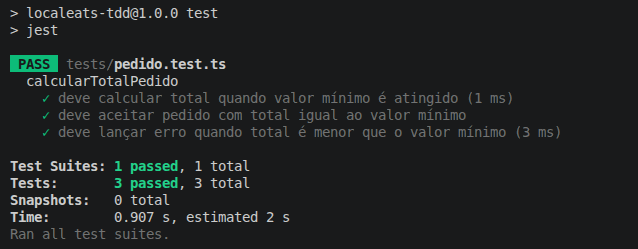

# Aula 9 – Testes Unitários e TDD – LocalEats

## 👤 Integrante
- Angelo Fonseca

## 📁 Estrutura do Projeto

```
.
├── src/
│   └── pedido.ts
└── tests/
    └── pedido.test.ts
```

---

## 🔹 1. Funcionalidade escolhida

### 🍔 Cálculo do total do pedido com valor mínimo
**Implementação:** `/src/pedido.ts` · **Testes:** `/tests/pedido.test.ts`

- **O que faz:** Soma os valores dos itens e valida se o pedido atinge o valor mínimo.
- **Problema que resolve:** Evita pedidos inválidos que não atendem às regras do restaurante no LocalEats.
- **Importância:** Regra central do fluxo de compra.
- **Regras de negócio:**
  - Total = soma dos preços dos itens
  - Se total < valor mínimo → erro
  - Caso contrário → retorna o total

---

## 🔹 3. Aplicação do TDD

Ciclo completo aplicado na funcionalidade **Cálculo do total do pedido**.

### 🔴 Red – Escrever o teste antes da implementação
Escrevi primeiro o Teste 1, sem o código existir. O Jest acusa falha porque a função ainda não foi exportada.

### 🟢 Green – Implementação mínima para o teste passar
Criei a versão mais simples para fazer o teste passar.

```ts
export function calcularTotalPedido(itens: { preco: number }[], _valorMinimo: number): number {
  return itens.reduce((acc, i) => acc + i.preco, 0);
}
```

### 🔵 Refactor – Melhorar mantendo os testes verdes
Adicionei a validação de valor mínimo e refinei nomes/tipos.

```ts
export type Item = { preco: number };

export function calcularTotalPedido(itens: Item[], valorMinimo: number): number {
  const total = itens.reduce((acc, item) => acc + item.preco, 0);
  if (total < valorMinimo) {
    throw new Error("Valor mínimo do pedido não atingido");
  }
  return total;
}
```
---

## 🔹 4. Refatoração

Melhorias aplicadas após o ciclo TDD:

- **Tipagem clara:** criação do tipo Item em vez de inline { preco: number }[], melhorando legibilidade e reuso.
- **Nomes mais descritivos:** _valorMinimo virou: valorMinimo. E a variável temporária ganhou o nome total.
- **Mensagem de erro padronizada:** Error com mensagem descritiva, facilitando a asserção nos testes (toThrow).
- **Função pura:** sem efeitos colaterais, ou seja, recebe entradas, devolve saída ou erro, o que torna o teste determinístico.

---

## 🔹 5. Execução dos Testes

- 3 Testes
- 3 Passaram
- 0 Falharam


---

## 🔹 6. Reflexão no contexto do LocalEats

### Foi difícil escrever testes antes do código?
É estranho pensar no resultado antes de desenvolver o código, mas não foi difícil.

### O TDD ajudou no desenvolvimento?
Sim. Ajuda a seguir um padrão pré-estabelecido.

### Os testes aumentaram a confiança no código?
Sim, pois previne erros.

### O que melhorariam?
- Cobrir mais cenários

### Como isso ajuda no projeto (LocalEats)?
Permite evoluir o sistema com segurança: novas faixas de valor mínimo, alterações na composição do pedido ou novas validações podem ser introduzidas sem medo de quebrar regras existentes, porque os testes vão acusar imediatamente.
