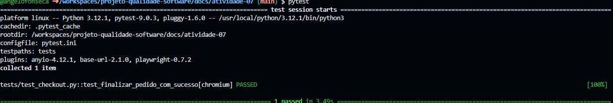

# 🧩 Atividade PBL – Aula 10

## 🔹 1. Fluxo funcional escolhido

**Fluxo de pedido (checkout)**

| Item | Descrição |
|------|-----------|
| 🔎 O que faz | Permite ao usuário escolher um produto, adicionar ao carrinho e finalizar o pedido |
| 🎯 Importância | Fluxo crítico — ação essencial do usuário |

---

## 🔹 2. Teste com Codegen

### 💻 Comando utilizado
```bash
playwright codegen https://local-eats-unisenac.vercel.app/
```

### 🔗 Link para o código gerado
👉 [`tests/codegen_checkout.py`](tests/codegen_checkout.py)

### 🧠 Observações
- O codegen facilita a etapa inicial. 
Basta navegar manualmente pelo site uma vez e o Playwright gera o código de interação.
- Não tem nenhuma asserção. É um script de navegação, não um teste de verdade. Foi necessário refatorar.

---

## 🔹 3. Teste automatizado com Pytest

### 🔗 Link para o teste
👉 [`tests/test_checkout.py`](./tests/test_checkout.py)

### 📌 O que o teste faz?
1. Acessa a página de login do LocalEats
2. Realiza o login com email e senha
3. Seleciona o primeiro restaurante
4. Adiciona o primeiro item do cardápio ao carrinho
5. Clica em "Finalizar Pedido"
6. Valida que o botão "Ver Detalhes" aparece

---

## 🔹 4. Refatoração com Page Object Model (POM)

### 🔗 Link para Page Object
👉 [`pages/checkout_page.py`](./pages/checkout_page.py)

### 🔗 Link para teste refatorado
👉 [`tests/test_checkout.py`](./tests/test_checkout.py)

### 🧠 Melhorias realizadas
- Separação entre teste e lógica de UI
- Código mais organizado
- Legibilidade

## 🔹 5. Execução dos testes

### ▶️ Comando
```bash
pytest
```

### 📸 Evidência

---

## 🔹 6. Análise crítica
- Seletores específico demais: o codegen capturou name=" Adicionar" — com espaço em branco no início do nome. Caso o espaçamento seja removido, o teste quebra.

- Credenciais hardcoded: o teste tem email e senha em texto puro no código.
- Falta de cenários negativos: atualmente só testamos o "caminho feliz".
---

## 🔹 7. Reflexão
- Testes automatizados não substituem testes manuais: 
- Foco em fluxos críticos
- Maior confiança no sistema

---

## 💡 Conclusão

O Codegen é um bom ponto de partida, mas o código gerado precisa sempre passar por uma etapa de refatoração para ser viável. Fica claro que um teste depende menos da ferramenta usada e mais das boas práticas de design — bons seletores, dados de teste controlados, separação de responsabilidades e cobertura de cenários negativos. A automação melhora a qualidade do produto, mas exige tempo.