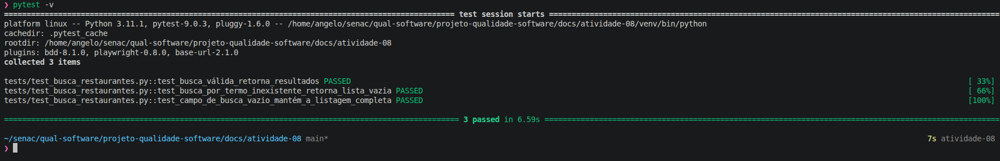

# Aula 12 – BDD e Automação Orientada a Comportamento

## 🔹 1. Fluxo escolhido

### Fluxo
Busca de Restaurantes

### Objetivo
Validar se a busca funciona corretamente.


# 🔹 2. Cenários BDD

## Arquivo

```text
atividade-08/features/busca_restaurantes.feature
```

```gherkin
Feature: Busca de restaurantes
  Como um usuário do LocalEats
  Quero pesquisar restaurantes por nome ou tipo de culinária
  Para encontrar rapidamente um lugar para comer

  Scenario: Busca válida retorna resultados
    Given que o usuário está logado
    When o usuário pesquisa por "Centro"
    Then o sistema deve exibir pelo menos um restaurante

  Scenario: Busca por termo inexistente retorna lista vazia
    Given que o usuário está logado
    When o usuário pesquisa por "Fast Food"
    Then o sistema não deve exibir nenhum restaurante

  Scenario: Campo de busca vazio mantém a listagem completa
    Given que o usuário está logado
    When o usuário realiza uma busca com o campo vazio
    Then o sistema deve manter a listagem completa de restaurantes

```

---

# 🔹 3. Automação com pytest-bdd

## Estrutura do projeto

```text
atividade-08/
│
├── features/
│   └── busca_restaurantes.feature
│
├── tests/
│   └── test_busca_restaurantes.py
│
├── evidencias/
│
└── README.md
```

## Arquivo

```text
tests/test_busca_restaurantes.py
```

## Código


```text
from pytest_bdd import scenarios, given, when, then
from playwright.sync_api import expect

scenarios("../features/busca_restaurantes.feature")

EMAIL = "angelofonseca1997@gmail.com"
SENHA = "123"

CARD = "a[href*='restaurant.html']"
BUSCA = "Buscar por culinária ou localização..."


def _fazer_login(page):
    page.goto("https://local-eats-unisenac.vercel.app/static/login.html")
    page.get_by_role("textbox", name="teste@teste.com").fill(EMAIL)
    page.get_by_role("textbox", name="Sua senha secreta").fill(SENHA)
    page.locator("#loginForm").get_by_role("button", name="Entrar").click()
    expect(page.locator(CARD).first).to_be_visible()


@given("que o usuário está logado")
def usuario_logado(page):
    _fazer_login(page)


def _buscar(page, termo: str):
    page.get_by_role("textbox", name=BUSCA).fill(termo)
    page.get_by_role("button", name="Buscar").click()


@when('o usuário pesquisa por "Centro"')
def pesquisa_centro(page):
    _buscar(page, "Centro")


@when('o usuário pesquisa por "Fast Food"')
def pesquisa_fast_food(page):
    _buscar(page, "Fast Food")


@when("o usuário realiza uma busca com o campo vazio")
def pesquisa_vazia(page):
    _buscar(page, "")


@then("o sistema deve exibir pelo menos um restaurante")
def exibe_restaurantes(page):
    expect(page.locator(CARD).first).to_be_visible()


@then("o sistema não deve exibir nenhum restaurante")
def nao_exibe_restaurantes(page):
    expect(page.locator(CARD)).to_have_count(0)


@then("o sistema deve manter a listagem completa de restaurantes")
def mantem_listagem(page):
    expect(page.locator(CARD)).to_have_count(15)
```

---

# 🔹 4. Execução dos testes

```bash
pytest -v
```

## Resultado

```text
==================================================================================================== test session starts ====================================================================================================
platform linux -- Python 3.11.1, pytest-9.0.3, pluggy-1.6.0 -- /home/angelo/senac/qual-software/projeto-qualidade-software/docs/atividade-08/venv/bin/python
cachedir: .pytest_cache
rootdir: /home/angelo/senac/qual-software/projeto-qualidade-software/docs/atividade-08
plugins: bdd-8.1.0, playwright-0.8.0, base-url-2.1.0
collected 3 items                                                                                                                                                                                                           

tests/test_busca_restaurantes.py::test_busca_válida_retorna_resultados PASSED                                                                                                                                         [ 33%]
tests/test_busca_restaurantes.py::test_busca_por_termo_inexistente_retorna_lista_vazia PASSED                                                                                                                         [ 66%]
tests/test_busca_restaurantes.py::test_campo_de_busca_vazio_mantém_a_listagem_completa PASSED                                                                                                                         [100%]

===================================================================================================== 3 passed in 7.55s =====================================================================================================
```

---

# 🔹 5. Evidências



---

## 🔹 6. Análise crítica

**O cenário escrito ficou compreensível?**
Sim. Frases como "o usuário pesquisa por pizza" e "o sistema deve exibir pelo menos um restaurante" são entendíveis por qualquer pessoa, sem conhecimento técnico.

**O teste automatizado ficou legível?**
Sim — cada step tem nome em português alinhado ao Gherkin, e a lógica de cada um é curta e direta. A separação Given/When/Then deixa claro o que é preparação, ação e verificação.

**O BDD ajudou a entender o comportamento?**
Ajudou bastante. Escrever o cenário *antes* forçou a pensar na regra ("o que deve acontecer quando busco algo que não existe?") em vez de já partir para clicar em elementos.

**Quais dificuldades surgiram?**
A principal foi não conhecer o DOM real do sistema, o que torna os seletores uma aposta. A segunda foi decidir *como* a busca dispara (ao digitar, com Enter ou com botão) — resolvi com `fill` + `Enter` + uma pequena espera.

**Os seletores foram frágeis?**
Em parte. Seletores por classe CSS (`.card`) quebram facilmente se o time mudar o estilo. Por isso centralizei tudo no topo e recomendo migrar para `data-testid`, que é estável.

**O teste ficou dependente da interface?**
Sim, como todo teste E2E. A mitigação foi não depender de textos exatos de restaurantes (que mudam), e sim de *contagem de resultados* e da *presença/ausência* de cards.

**O cenário representa realmente uma regra de negócio?**
Sim: "busca válida traz resultados, busca sem correspondência traz vazio, e campo vazio não esconde nada" é uma regra de negócio legítima da descoberta de restaurantes.

**O que tornaria o teste mais robusto?**
- Usar `data-testid` nos elementos-chave do sistema.
- Usar *web assertions* do Playwright (`expect(locator).to_have_count(...)`) com auto-wait, em vez de `wait_for_timeout` fixo.
- Apontar para um ambiente/dados de teste estáveis (massa de dados controlada).

---

## 🔹 7. Reflexão no contexto do LocalEats

**BDD melhora a comunicação entre a equipe?**
Sim. Os cenários em Gherkin viram uma linguagem comum entre negócio, QA e desenvolvimento — todo mundo lê o mesmo texto e concorda sobre o comportamento esperado.

**Todo teste deve ser escrito em BDD?**
Não. BDD brilha em comportamentos de negócio de ponta a ponta. Para lógica interna fina (cálculos, validações de função), testes unitários são mais baratos e rápidos. BDD em tudo geraria sobrecarga.

**Quando vale a pena usar BDD?**
Quando o comportamento precisa ser entendido e validado por pessoas não técnicas, ou quando o requisito é ambíguo e descrever o cenário ajuda a alinhar a expectativa antes de codar.

**O comportamento ficou mais claro?**
Ficou. Transformar "busca de restaurantes" em três cenários explícitos eliminou a ambiguidade sobre o que o sistema deveria fazer em cada situação.

**Como isso ajuda no projeto do grupo?**
Cria **documentação viva**: os arquivos `.feature` descrevem o comportamento esperado *e* são executáveis. Quando algo quebra, o cenário aponta exatamente qual regra de negócio deixou de funcionar — o que é especialmente útil num sistema em evolução como o LocalEats.
